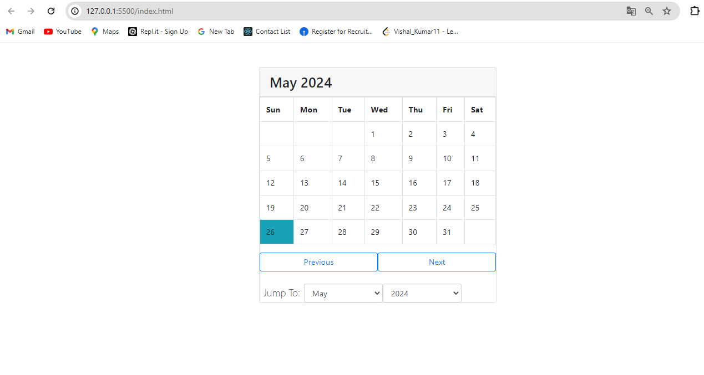

# Calendar Project

This project is a simple, interactive calendar built using HTML, CSS (Bootstrap), and JavaScript. It allows users to navigate through months and years, and highlights the current date.

## Features

- Display the current month and year.
- Navigate to the next and previous months.
- Jump to a specific month and year.
- Highlights the current date.

## Getting Started

### Prerequisites

To view and run this project, you need a web browser.

### Installation

1. Clone the repository or download the files.
2. Open `index.html` in your web browser.

### Project Structure

- `index.html`: The main HTML file that contains the structure of the calendar.
- `scripts.js`: The JavaScript file that contains the logic for the calendar navigation and display.

## Usage

- Open `index.html` in your web browser.
- Use the "Previous" and "Next" buttons to navigate between months.
- Use the "Jump To" dropdowns to select a specific month and year.

## Code Overview

### HTML

The `index.html` file contains the basic structure of the calendar, including:

- A `div` container for the calendar.
- A `table` element for displaying the days of the month.
- Buttons for navigating between months.
- Dropdowns for jumping to a specific month and year.

### JavaScript

The `scripts.js` file contains the following functions:

- `showCalendar(month, year)`: Displays the calendar for the specified month and year.
- `next()`: Moves the calendar to the next month.
- `previous()`: Moves the calendar to the previous month.
- `jump()`: Jumps to the selected month and year.

### External Libraries

- Bootstrap 4.1.0: Used for styling and responsiveness.
- jQuery, Popper.js, and Bootstrap JS: Included for additional Bootstrap functionality.

### CSS

The project uses Bootstrap for styling. The current date is highlighted using a Bootstrap class (`bg-info`).

## Contributing

If you would like to contribute to this project, please fork the repository and submit a pull request.

## License

This project is open source and available under the [MIT License](LICENSE).

## Acknowledgements

- Bootstrap: [https://getbootstrap.com](https://getbootstrap.com)
- jQuery: [https://jquery.com](https://jquery.com)
- Popper.js: [https://popper.js.org](https://popper.js.org)

## Output

- show th Calender page
